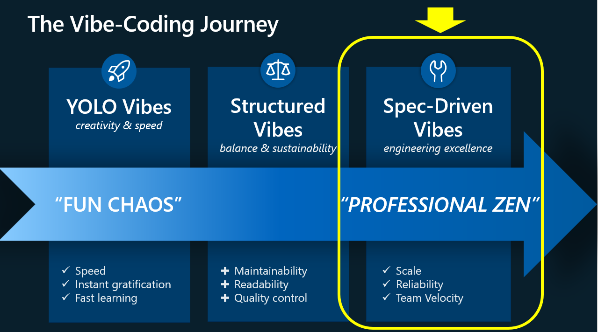

# 🚀 From Vibes to Value: A Spec-Driven AI Development Journey

## The Evolution of Vibe-Coding: From Chaos to Professional Zen

Welcome to the **Spec-Driven Vibe Coding Challenge** – where we transform ambiguous ideas into production-ready AI systems through a revolutionary development approach. This project demonstrates the journey from "YOLO Vibes" (fast, creative, chaotic) through "Structured Vibes" (balanced and sustainable) to achieve **"Spec-Driven Vibes"** – the pinnacle of engineering excellence where creativity meets precision.

In traditional development, we often jump straight into coding, letting the "vibes" guide us without clear direction. This leads to technical debt, misaligned features, and costly iterations. **Spec-Driven Vibing** flips this paradigm: we start with comprehensive specifications, leverage AI to draft from artifacts (transcripts, tickets, requirements), front-load review steps with tests and API schemas before any code exists, and maintain living documentation that evolves with the product. This approach enables us to build with the speed of creativity while maintaining the rigor of enterprise engineering.



This repository showcases an example implementation of Spec-Driven Vibes, taking an ambiguous challenge – "build a better chatbot for Azure Managed Grafana" – and systematically transforming it into a modular, scalable AI agent system. Through detailed specifications, architectural planning, and iterative development, we demonstrate how to achieve **"Professional Zen"** – where rapid prototyping meets production readiness, enabling teams to scale reliably while maintaining velocity.

## 🎯 Project's summary

This project develops a **domain-specific AI agent for Azure Managed Grafana (AMG)** that demonstrates how to move from hypothesis to prototype in an evidence-driven manner. The solution creates a specialized conversational agent that provides precise, domain-specific insights compared to generic chatbots, addressing the gap between generic AI assistance and deep domain knowledge. The system is designed with a modular, reusable architecture that can be adapted for other technical product domains, providing a scalable foundation for organizations seeking to enhance their customer engagement through specialized AI agents.


🏗️ **Detailed Architecture**: For comprehensive architecture documentation, technology stack details, and evolution roadmap, see [Architecture & Technologies](docs/04-architecture-technologies.md).

The architecture implements a modular AI agent system built around **Model Context Protocol (MCP)**, **Semantic Kernel**, and **Azure AI Foundry**. Starting with a lightweight prototype using STDIO transport and file-based knowledge storage, the system prioritizes rapid development and validation over scalability. The solution consists of three core components: a **Knowledge Base MCP Server** for domain-specific information access, an **Orchestration Agent** for conversation coordination using Semantic Kernel, and integration with MCP-compatible clients like GitHub Copilot and Claude Desktop for natural language interaction.

## 🏗️ Repository Structure

### 📚 Documentation
- [`docs/`](docs/) - Comprehensive project documentation
  - [`03-idea-vision-scope.md`](docs/03-idea-vision-scope.md) - Project vision, scope, and requirements
  - [`04-architecture-technologies.md`](docs/04-architecture-technologies.md) - Architecture patterns and technology stack
  - [`simplified-directions/`](docs/simplified-directions/) - Quick technical directions and architecture diagrams
  - [`features/`](docs/features/) - Feature-specific documentation organized per feature:
    - `kb-mcp-server/` (specs-kb-mcp-server.md, implementation-plan-kb-mcp-server.md, future tasks/tech-research docs)
    - `orchestrator-agent/` (specs-orchestrator-agent.md, implementation-plan-orchestrator-agent.md, example-program-semantic-kernel-orchestrator-mcp-server.cs)
    - `chat-agent/` (specs-chat-agent.md, implementation-plan-chat-agent.md)


### 🔧 Source Code
- [`src/mcp-server-kb-content-fetcher/`](src/mcp-server-kb-content-fetcher/) - Knowledge Base MCP Server
- [`src/orchestrator-agent/`](src/orchestrator-agent/) - Orchestration Agent MCP Server

### 🧪 Tests
- [`tests/mcp-server-kb-content-fetcher.unit-tests/`](tests/mcp-server-kb-content-fetcher.unit-tests/) - Unit tests for KB server
- [`tests/mcp-server-kb-content-fetcher.integration-tests/`](tests/mcp-server-kb-content-fetcher.integration-tests/) - Integration tests for KB server
- [`tests/orchestrator-agent.unit-tests/`](tests/orchestrator-agent.unit-tests/) - Unit tests for orchestrator
- [`tests/orchestrator-agent.integration-tests/`](tests/orchestrator-agent.integration-tests/) - Integration tests for orchestrator
- [`tests/orchestrator-agent.smoke-tests/`](tests/orchestrator-agent.smoke-tests/) - Smoke tests for orchestrator

### ⚙️ Configuration
- [`.vscode/mcp.json`](.vscode/mcp.json) - VS Code MCP server configuration
- [`dev.env.example`](dev.env.example) - Environment variables template

## 🚀 Quick Start Guide

### Prerequisites

- **.NET Runtime**: .NET 9 (fallback: .NET 8)
- **Operating System**: Windows, macOS, or Linux
- **MCP-Compatible Client**: VS Code with GitHub Copilot or Claude Desktop
- **Azure AI Foundry**: API credentials (for LLM capabilities)

### 📦 Installation & Build

```bash
# 1. Clone the repository
git clone https://github.com/CESARDELATORRE/spec-driven-vibe-coding-challenge.git
cd spec-driven-vibe-coding-challenge

# 2. Build the solution
dotnet clean
dotnet build

# 3. Verify build output
ls -la src/*/bin/Debug/net*/
```

### 🔧 MCP Servers Setup

#### 🆚 VS Code GitHub Copilot Integration

The repository includes a pre-configured [`.vscode/mcp.json`](.vscode/mcp.json) file for seamless integration.
You can simply check it out. No need initially to change it.

```jsonc
{
  // Local Orchestration-Agent MCP Server
  "servers": {
      "orchestrator-agent": {
          "command": "dotnet",
          "args": [
              "run",
              "--project",
              "./src/orchestrator-agent"
              ]
      }
  }
}
```
If you want to also (for testing purposes) directly access the Knowledge-Base MCP Sever from GitHub CoPilot, just to see the raw data of the KB, you can also do it by adding the KB MCP Server configuration to the [`.vscode/mcp.json`](.vscode/mcp.json) file, like in the following JSON config.

```jsonc
{
  "servers": {
      // Local custom KB MCP server
      "kb-content-fetcher": {
          "command": "dotnet",
          "args": ["run",
            "--project",
          "./src/mcp-server-kb-content-fetcher"
          ]
      },
      // Local Orchestration-Agent MCP Server
      "orchestrator-agent": {
          "command": "dotnet",
          "args": [
              "run",
              "--project",
              "./src/orchestrator-agent"
              ]
      },
  }
}
```


### 🔑 Environment Configuration

1. ✅ Most configuration is already in the repository. But you need to configure a few ENVIRONMENT VARIABLES.

    - A. You can set the ENV VARS directly in your OS (i.e. Windows System ENV VARS), or at the terminal level.

    - B. You can set the ENV VARS at a terminal level, only, as long as you always do it before opening VS Code with "code .".

    For setting ENV VARS at the terminal leveL:
    Open terminal and go to the root folder of the repo.

    > **💡 IMPORTANT NOTE**: Ensure your `dev.env` is configured with Azure AI Foundry credentials and before testing the orchestrator.

    ```bash
    # 1. Copy environment template to your own dev.env file (excluded at .gitignore so you won't push secrets to GitHub)
    cp dev.env.example dev.env

    # 2. Edit dev.env with your Azure AI Foundry credentials
    # AzureOpenAI__Endpoint=https://your-resource.openai.azure.com/
    # AzureOpenAI__DeploymentName=gpt-4o-mini
    # AzureOpenAI__ApiKey=YOUR_ACTUAL_API_KEY
    ```

    Set env vars with PowerShell by running this command:

      ```powershell
        Get-Content dev.env | ForEach-Object { if ($_ -match '^(.*?)=(.*)$') { $n=$matches[1]; $v=$matches[2]; [Environment]::SetEnvironmentVariable($n,$v) } }
      ```

      Check any of the ENV VARS in the terminal

      In PowerShell:

      ```bash
      $env:AzureOpenAI__DeploymentName

      $env:AzureOpenAI__Endpoint

      $env:AzureOpenAI__ApiKey

      $env:KbMcpServer__ExecutablePath

      $env:Orchestrator__UseFakeLlm
      ```

  2. 🔄 Open VS Code with "code ." at the terminal.
  3. 💬 Open GitHub Copilot Chat panel
  4. Start the MCP Servers from the mcp.json file or using "Ctrl+Shift+P"
  5. 🧪 Test with queries (see examples below)

      **Example prompts in Natural Language, for GitHub CoPilot in VS Code:**

      ```
      Get the orchestrator Health status

      Get the orchestrator Diagnostics Information and show ALL of it properly formatted here in the chat.

      Use my orchestrator to give me a short definition of Azure Managed Grafana as well as a short description of its pricing.
      
      ```

      


### 🏠 Claude Desktop Integration

  Add to your Claude Desktop configuration file:

  **Windows**: `%APPDATA%\Claude\claude_desktop_config.json`

  **macOS**: `~/Library/Application Support/Claude/claude_desktop_config.json`

  ```json
  {
    "mcpServers": {
      "orchestrator-agent": {
        "command": "dotnet",
        "args": ["run", "--project", "/absolute/path/to/your/project/src/orchestrator-agent"]
      }
    }
  }
  ```

  **Example prompt for Claude:**

  ```
  Use my orchestrator to give me a short definition of Azure Managed Grafana as well as a short description of its pricing.
  ```

  

  
  NOTE: Claude Code uses a different configuration.
  For **Claude Code** you need to put it here (claude_code_config.json):
  ```
  Windows: %APPDATA%\Claude Code\claude_code_config.json
  ```

## 💬 Additional Usage Examples

### 🎯 Chat Orchestrator Queries

Try these natural language queries with the orchestrator agent:

```bash
# General information
"Using the orchestrator, Give me an overview of Azure Managed Grafana"

# Pricing and features
"Using the orchestrator, What are the pricing options for Azure Managed Grafana?"
"Using the orchestrator, Tell me about Azure Managed Grafana key features"

```

### 🔍 Trying directly the Knowlege Base MCP Server from your MCP client UIs

Since the KB MCP Server is also configured at the mcp.json in VS CODE, you can also try it directly.

Use explicit MCP tool calls in supported clients (GitHub CoPilot, Claude):


```

Give me the health status of the kb-content-fetcher MCP server

Use the kb-content-fetcher MCP server to get all the raw knowledge base content

```

## 🧪 Testing - Unit Tests and Integration Tests

### Option A: Run all Tests

From GitHub CoPilot, drag and drop the **test.prompt.md** file and it will automatically execute all the tests.

### Option B: Unit Tests
```bash
# Run all unit tests
dotnet test tests/mcp-server-kb-content-fetcher.unit-tests/
dotnet test tests/orchestrator-agent.unit-tests/

# Run with coverage
dotnet test --collect:"XPlat Code Coverage"
```

### Option C: Integration Tests
```bash
# Test MCP protocol compliance
dotnet test tests/mcp-server-kb-content-fetcher.integration-tests/
dotnet test tests/orchestrator-agent.integration-tests/

# Smoke tests
dotnet test tests/orchestrator-agent.smoke-tests/
```

You can also run the tests from VS Code and the TEST EXPLORER.

## 🏗️ Architecture Details

🏗️ **Complete Architecture Documentation**: See [Architecture & Technologies](docs/04-architecture-technologies.md) for detailed architectural patterns, technology decisions, and evolution roadmap.

### Core Components

| Component | Purpose | Technology Stack |
|-----------|---------|------------------|
| **KB MCP Server** | Domain knowledge access via MCP protocol | .NET 9, MCP SDK, File-based storage |
| **Orchestration Agent** | Conversation coordination and multi-step planning | .NET 9, Semantic Kernel, MCP SDK |
| **Chat Agent** | Currently using the ChatCompletionAgent class within the Orchestratorm, for LLM interaction and response processing | Semantic Kernel, LLM model in Azure Foundry |
| **MCP Clients** | User interface (VS Code, Claude Desktop) | GitHub Copilot, Claude Desktop |

### Communication Flow
1. **User Query** → MCP Client (VS Code/Claude)
2. **MCP Client** → Orchestration Agent (via STDIO MCP)
3. **Orchestration Agent** → Chat Agent (in-process Semantic Kernel)
4. **Orchestration Agent** → KB MCP Server (via STDIO MCP)
5. **Response** ← Synthesized and coordinated back to user

## 🛠️ Development

### Project Structure
```
src/
├── mcp-server-kb-content-fetcher/           # Knowledge Base MCP Server
│   ├── datasets/                            # Sample knowledge content
│   ├── services/                           # Business logic
│   ├── tools/                              # MCP tool implementations
│   └── models/                             # Data models
│
└── orchestrator-agent/                      # Orchestration MCP Server
    ├── services/                           # Orchestration logic
    ├── tools/                              # MCP tool implementations
    └── configuration/                      # Configuration classes

tests/
├── mcp-server-kb-content-fetcher.unit-tests/     # Fast, isolated tests
├── mcp-server-kb-content-fetcher.integration-tests/ # Protocol compliance
├── orchestrator-agent.unit-tests/               # Component tests
├── orchestrator-agent.integration-tests/        # End-to-end tests
└── orchestrator-agent.smoke-tests/              # Basic functionality
```

### Contributing Guidelines
1. 🔄 Follow the existing C# coding conventions
2. 📝 Update documentation for any architectural changes
3. 🧪 Add tests for new functionality
4. 🔍 Use the existing MCP patterns for new tools
5. 📊 Test with both VS Code and Claude Desktop

## 🐛 Troubleshooting

### Common Issues

**🚫 Server Won't Start**
- Check .NET 9 is installed: `dotnet --version`
- Verify environment variables are loaded: `echo $AzureOpenAI__ApiKey`
- Check build artifacts exist: `ls src/*/bin/Debug/net*/`

**🔌 MCP Connection Issues**
- Reload VS Code window after configuration changes
- Check MCP server logs in VS Code Output panel
- Verify file paths in `.vscode/mcp.json` are correct

**🔍 No Search Results**
- Verify `datasets/knowledge-base.txt` exists
- Check file permissions and content encoding
- Test with simple queries like "pricing"

**⚡ Build Failures**
- Clean and rebuild: `dotnet clean && dotnet build`
- Check for missing dependencies: `dotnet restore`
- Verify .NET 9 SDK is installed

### Getting Help

- 📖 Check detailed component READMEs:
  - [KB Server Documentation](src/mcp-server-kb-content-fetcher/README.md)
  - [Orchestrator Documentation](src/orchestrator-agent/README.md)
- 🔍 Review [implementation plans](docs/implementation-plans/)
- 📋 Check [feature specifications](docs/specs/)

## 🎯 What's Next?

This prototype demonstrates the core concepts. Future evolution paths include:

- **🌐 Transport Evolution**: HTTP/SSE for remote deployment
- **📚 Knowledge Expansion**: Integration with comprehensive documentation sources
- **🔄 Multi-Domain Support**: Extension to additional Azure services
- **🏢 Enterprise Features**: Advanced security, monitoring, and scalability

---

**🚀 Ready to get started?** Follow the [Quick Start Guide](#-quick-start-guide) above, or dive into the [detailed documentation](docs/) for more comprehensive guidance.

---

# Spec-Driven Vibe Coding Challenge

## Overview
This repository contains a prototype implementation of a domain-specific AI agent system using the Model Context Protocol (MCP). The prototype demonstrates an Azure Managed Grafana (AMG) expert agent that can answer technical questions by combining knowledge base lookup with LLM-powered conversational abilities.

## 📊 Current Status (September 2025)
- ✅ Architecture Variant 1 (Local Desktop) implemented
- ✅ KB MCP Server with text-based knowledge store
- ✅ Orchestrator Agent with in-process Chat Agent
- ✅ Basic test coverage (unit and integration tests)
- ⏳ Production AMG content (using placeholder data)
- ⏳ Architecture Variants 2-3 (future iterations)

---

**📅 Last Updated**: September 2025