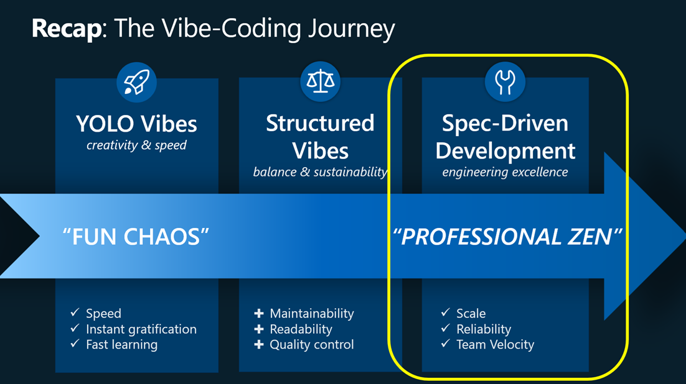

# 🚀 From Vibes to Value: A Spec-Driven AI Development Journey

**Transform ambiguous ideas into production-ready AI systems through specification-driven development.**

## 🎯 What is This Project?

This repository demonstrates **Spec-Driven Development** applied to building a domain-specific AI agent for Azure Managed Grafana (AMG). It showcases the journey from "YOLO Vibes Coding" (fast but chaotic) through "Structured Vibes" (balanced) to achieve **"Spec-Driven Development"** – where creativity meets engineering precision.

**The Problem:** Unstructured AI-driven development leads to technical debt, misaligned features, and costly iterations when we jump straight into coding without clear direction.

**The Solution:** Spec-Driven Development flips this paradigm:
- ✅ Start with comprehensive specifications
- ✅ Leverage AI to draft from artifacts (transcripts, tickets, requirements)
- ✅ Front-load review with tests and API schemas before code exists
- ✅ Maintain living documentation that evolves with the product
- ✅ Build with creative speed while maintaining enterprise rigor



### What You'll Find Here

This repository implements a **domain-specific AI agent for Azure Managed Grafana (AMG)** that demonstrates:
- 🏗️ Modular, reusable architecture using **Model Context Protocol (MCP)**
- 🤖 AI orchestration with **Semantic Kernel** and **Azure AI Foundry**
- 📚 Knowledge base integration for domain-specific insights
- 🔄 Complete specification-to-implementation workflow
- 🧪 Comprehensive testing patterns (unit & integration)

---

## 🌱 Built with GitHub Spec-Kit

<table>
  <tr>
    <td align="center">
      
    </td>
    <td align="center">
      
    </td>
  </tr>
</table>

This project leverages **[GitHub Spec-Kit](https://github.com/github/spec-kit/)**, an open-source toolkit from GitHub (currently in Preview) that supports spec-driven development where specifications are executable artifacts that guide code generation.

**Key Features:**
- 📋 Structured workflow: specify → plan → tasks → implement
- 🤖 Integrates with AI coding agents (Copilot, Claude, Gemini)
- 📝 Pre-written prompt templates and helper scripts
- 🏛️ Project "constitution" support for team norms and constraints
- ⚙️ Optional CLI tool ("Specify") for scaffolding and enforcement

---

## 🏗️ System Architecture


The architecture implements a modular AI agent system built around **Model Context Protocol (MCP)**, **Semantic Kernel**, and **Azure AI Foundry**. Starting with a lightweight prototype using STDIO transport and file-based knowledge storage, the system prioritizes rapid development and validation over scalability.

### Core Components

| Component | Purpose | Technology Stack |
|-----------|---------|------------------|
| **KB MCP Server** | Domain knowledge access via MCP protocol | .NET 9, MCP SDK, File-based storage |
| **Orchestration Agent** | Conversation coordination and multi-step planning | .NET 9, Semantic Kernel, MCP SDK |
| **Chat Agent** | LLM interaction and response processing (in-process) | Semantic Kernel, Azure AI Foundry |
| **MCP Clients** | User interface (VS Code, Claude Desktop) | GitHub Copilot, Claude Desktop |

### Communication Flow

1. **User Query** → MCP Client (VS Code/Claude)
2. **MCP Client** → Orchestration Agent (via STDIO MCP)
3. **Orchestration Agent** → Chat Agent (in-process Semantic Kernel)
4. **Orchestration Agent** → KB MCP Server (via STDIO MCP)
5. **Response** ← Synthesized and coordinated back to user

🏗️ **Complete Architecture Documentation**: For detailed architectural patterns, technology decisions, and evolution roadmap, see [Architecture & Technologies](docs/architecture-technologies.md).

---

## 🏗️ Repository Structure

### 📚 Documentation
- [`docs/`](docs/) - Comprehensive project documentation
  - [`idea-vision-scope.md`](docs/idea-vision-scope.md) - Project vision, scope, and requirements
  - [`architecture-technologies.md`](docs/architecture-technologies.md) - Architecture patterns and technology stack
  - [`simplified-directions/`](docs/simplified-directions/) - Quick technical directions and architecture diagrams
  - [`features/`](docs/features/) - Feature-specific documentation organized per feature:
    - **Knowledge Base MCP Server** (`kb-mcp-server/`):
      - [`specs-kb-mcp-server.md`](docs/features/kb-mcp-server/specs-kb-mcp-server.md) - Functional specifications
      - [`plan-kb-mcp-server.md`](docs/features/kb-mcp-server/plan-kb-mcp-server.md) - Implementation plan
      - [`tasks-kb-mcp-server.md`](docs/features/kb-mcp-server/tasks-kb-mcp-server.md) - Development tasks
      - [`research-kb-mcp-server.md`](docs/features/kb-mcp-server/research-kb-mcp-server.md) - Technical research
      - [`quickstart.md`](docs/features/kb-mcp-server/quickstart.md) - Developer guide
    - **Orchestrator Agent** (`orchestrator-agent/`):
      - [`specs-orchestrator-agent.md`](docs/features/orchestrator-agent/specs-orchestrator-agent.md) - Functional specifications
      - [`plan-orchestrator-agent.md`](docs/features/orchestrator-agent/plan-orchestrator-agent.md) - Implementation plan
      - [`tasks-orchestrator-agent.md`](docs/features/orchestrator-agent/tasks-orchestrator-agent.md) - Development tasks
      - [`research-orchestrator-agent.md`](docs/features/orchestrator-agent/research-orchestrator-agent.md) - Technical research
      - [`quickstart-orchestrator-agent.md`](docs/features/orchestrator-agent/quickstart-orchestrator-agent.md) - Developer guide

### 🔧 Source Code
- [`src/mcp-server-kb-content-fetcher/`](src/mcp-server-kb-content-fetcher/) - Knowledge Base MCP Server
- [`src/orchestrator-agent/`](src/orchestrator-agent/) - Orchestration Agent MCP Server

### 🧪 Tests
- [`tests/mcp-server-kb-content-fetcher.unit-tests/`](tests/mcp-server-kb-content-fetcher.unit-tests/) - Unit tests for KB server
- [`tests/mcp-server-kb-content-fetcher.integration-tests/`](tests/mcp-server-kb-content-fetcher.integration-tests/) - Integration tests for KB server
- [`tests/orchestrator-agent.unit-tests/`](tests/orchestrator-agent.unit-tests/) - Unit tests for orchestrator
- [`tests/orchestrator-agent.integration-tests/`](tests/orchestrator-agent.integration-tests/) - Integration tests (includes smoke test scenarios)

### ⚙️ Configuration
- [`.vscode/mcp.json`](.vscode/mcp.json) - VS Code MCP server configuration
- [`dev.env.example`](dev.env.example) - Environment variables template

---

## 🚀 Quick Start Guide

### Prerequisites

- **.NET Runtime**: .NET 9 (fallback: .NET 8)
- **Operating System**: Windows, macOS, or Linux
- **MCP-Compatible Client**: VS Code with GitHub Copilot or Claude Desktop
- **Azure AI Foundry**: API credentials (for LLM capabilities)

### 📦 Installation & Build

```bash
# 1. Clone the repository
git clone https://github.com/CESARDELATORRE/spec-driven-vibe-coding-challenge.git
cd spec-driven-vibe-coding-challenge

# 2. Build the solution
dotnet clean
dotnet build

# 3. Verify build output
ls -la src/*/bin/Debug/net*/
```

### 🔑 Environment Configuration

> **💡 IMPORTANT**: Ensure your `dev.env` is configured with Azure AI Foundry credentials before testing the orchestrator.

```bash
# 1. Copy environment template
cp dev.env.example dev.env

# 2. Edit dev.env with your Azure AI Foundry credentials
# AzureOpenAI__Endpoint=https://your-resource.openai.azure.com/
# AzureOpenAI__DeploymentName=gpt-4o-mini
# AzureOpenAI__ApiKey=YOUR_ACTUAL_API_KEY
```

**Set environment variables:**

**PowerShell:**
```powershell
Get-Content dev.env | ForEach-Object { if ($_ -match '^(.*?)=(.*)$') { $n=$matches[1]; $v=$matches[2]; [Environment]::SetEnvironmentVariable($n,$v) } }

# Verify
$env:AzureOpenAI__DeploymentName
$env:AzureOpenAI__Endpoint
$env:AzureOpenAI__ApiKey
```

**Bash/Linux/macOS:**
```bash
export $(cat dev.env | xargs)
```

### 🔧 MCP Servers Setup

#### 🆚 VS Code GitHub Copilot Integration

The repository includes a pre-configured [`.vscode/mcp.json`](.vscode/mcp.json) file for seamless integration.

```jsonc
{
  // Local Orchestration-Agent MCP Server
  "servers": {
      "orchestrator-agent": {
          "command": "dotnet",
          "args": [
              "run",
              "--project",
              "./src/orchestrator-agent"
          ]
      }
  }
}
```

**Optional: Direct KB MCP Server Access (for testing)**

To directly access the Knowledge-Base MCP Server from GitHub Copilot (for raw data inspection), add this to [`.vscode/mcp.json`](.vscode/mcp.json):

```jsonc
{
  "servers": {
      "kb-content-fetcher": {
          "command": "dotnet",
          "args": ["run", "--project", "./src/mcp-server-kb-content-fetcher"]
      },
      "orchestrator-agent": {
          "command": "dotnet",
          "args": ["run", "--project", "./src/orchestrator-agent"]
      }
  }
}
```

#### 🏠 Claude Desktop Integration

Add to your Claude Desktop configuration file:

**Windows**: `%APPDATA%\Claude\claude_desktop_config.json`

**macOS**: `~/Library/Application Support/Claude/claude_desktop_config.json`

```json
{
  "mcpServers": {
    "orchestrator-agent": {
      "command": "dotnet",
      "args": ["run", "--project", "/absolute/path/to/your/project/src/orchestrator-agent"]
    }
  }
}
```

**Note for Claude Code**: Use `claude_code_config.json` instead:
```
Windows: %APPDATA%\Claude Code\claude_code_config.json
```

### 🧪 Testing Your Setup

1. Open VS Code from the terminal (after setting environment variables)
2. Open GitHub Copilot Chat panel
3. Start the MCP Servers from mcp.json or using "Ctrl+Shift+P"
4. Try these example queries:

**Example prompts for GitHub Copilot:**
```
Get the orchestrator Health status

Get the orchestrator Diagnostics Information and show ALL of it properly formatted here in the chat.

Use my orchestrator to give me a short definition of Azure Managed Grafana as well as a short description of its pricing.
```


**Example prompt for Claude:**
```
Use my orchestrator to give me a short definition of Azure Managed Grafana as well as a short description of its pricing.
```


---

## 💬 Usage Examples

### 🎯 Chat Orchestrator Queries

Try these natural language queries with the orchestrator agent:

```
# General information
"Using the orchestrator, Give me an overview of Azure Managed Grafana"

# Pricing and features
"Using the orchestrator, What are the pricing options for Azure Managed Grafana?"
"Using the orchestrator, Tell me about Azure Managed Grafana key features"
```

### 🔍 Direct Knowledge Base MCP Server Queries

If you've configured the KB MCP Server directly in your MCP client:

```
Give me the health status of the kb-content-fetcher MCP server

Use the kb-content-fetcher MCP server to get all the raw knowledge base content
```

---

## 🧪 Testing

### Run All Tests
From GitHub Copilot, drag and drop the **test.prompt.md** file to automatically execute all tests.

### Unit Tests
```bash
# Run all unit tests
dotnet test tests/mcp-server-kb-content-fetcher.unit-tests/
dotnet test tests/orchestrator-agent.unit-tests/

# Run with coverage
dotnet test --collect:"XPlat Code Coverage"
```

### Integration Tests
```bash
# Test MCP protocol compliance (includes smoke test scenarios)
dotnet test tests/mcp-server-kb-content-fetcher.integration-tests/
dotnet test tests/orchestrator-agent.integration-tests/
```

**Tip:** You can also run tests from VS Code TEST EXPLORER.

---

## 🛠️ Development

### Project Structure
```
src/
├── mcp-server-kb-content-fetcher/           # Knowledge Base MCP Server
│   ├── datasets/                            # Sample knowledge content
│   ├── services/                           # Business logic
│   ├── tools/                              # MCP tool implementations
│   └── models/                             # Data models
│
└── orchestrator-agent/                      # Orchestration MCP Server
    ├── services/                           # Orchestration logic
    ├── tools/                              # MCP tool implementations
    └── configuration/                      # Configuration classes

tests/
├── mcp-server-kb-content-fetcher.unit-tests/     # Fast, isolated tests
├── mcp-server-kb-content-fetcher.integration-tests/ # Protocol compliance
├── orchestrator-agent.unit-tests/               # Component tests
└── orchestrator-agent.integration-tests/        # End-to-end tests
```

### Contributing Guidelines
1. 🔄 Follow the existing C# coding conventions
2. 📝 Update documentation for any architectural changes
3. 🧪 Add tests for new functionality
4. 🔍 Use the existing MCP patterns for new tools
5. 📊 Test with both VS Code and Claude Desktop

---

## 🐛 Troubleshooting

### Common Issues

**🚫 Server Won't Start**
- Check .NET 9 is installed: `dotnet --version`
- Verify environment variables are loaded: `echo $AzureOpenAI__ApiKey` (or `$env:AzureOpenAI__ApiKey` in PowerShell)
- Check build artifacts exist: `ls src/*/bin/Debug/net*/`

**🔌 MCP Connection Issues**
- Reload VS Code window after configuration changes
- Check MCP server logs in VS Code Output panel
- Verify file paths in `.vscode/mcp.json` are correct

**🔍 No Search Results**
- Verify `datasets/knowledge-base.txt` exists
- Check file permissions and content encoding
- Test with simple queries like "pricing"

**⚡ Build Failures**
- Clean and rebuild: `dotnet clean && dotnet build`
- Check for missing dependencies: `dotnet restore`
- Verify .NET 9 SDK is installed

### Getting Help

- 📖 Check detailed component documentation:
  - [KB Server README](src/mcp-server-kb-content-fetcher/README.md)
  - [Orchestrator README](src/orchestrator-agent/README.md)
- 🔍 Review [feature documentation](docs/features/)
- 📋 Check [architecture documentation](docs/architecture-technologies.md)

---

## 🎯 What's Next?

This prototype demonstrates the core concepts. Future evolution paths include:

- **🌐 Transport Evolution**: HTTP/SSE for remote deployment
- **📚 Knowledge Expansion**: Integration with comprehensive documentation sources
- **🔄 Multi-Domain Support**: Extension to additional Azure services
- **🏢 Enterprise Features**: Advanced security, monitoring, and scalability

---

## 📊 Current Status

**Implementation Status (September 2025):**
- ✅ Architecture Variant 1 (Local Desktop) implemented
- ✅ KB MCP Server with text-based knowledge store
- ✅ Orchestrator Agent with in-process Chat Agent
- ✅ Basic test coverage (unit and integration tests)
- ⏳ Production AMG content (using placeholder data)
- ⏳ Architecture Variants 2-3 (future iterations)

---

**🚀 Ready to get started?** Follow the [Quick Start Guide](#-quick-start-guide) above, or dive into the [detailed documentation](docs/) for more comprehensive guidance.

**📅 Last Updated**: September 2025
