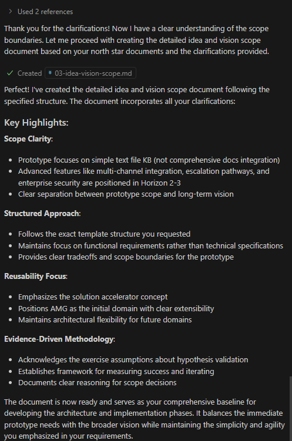
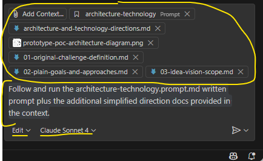
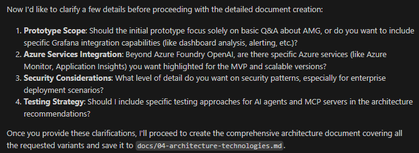

<h1 style="font-size: 3em;">Reasoning Journal Log</h1>

# Day 1
## Goals for Day 1 

- Create the repo structure, initial co-pilot instruction files, helper MCP servers config and the reasoning journal log approach and basic "north-star" goals and approaches baseline document":

    --> PR #1

- Create initial projects docs:
    - Create project's vision & scope document (comprehensive idea)

        --> PR #2

    - Create project's Architecture and technology decissions document

        --> PR #3

## Global setup

### GH repo

I want to work driven by issues and branches w/ related PRs, like when working with a dev team, so everything **can be trackable**.

In some cases I'll create the issues in github.com repo, in other cases directly using the GH MCP server.

About PRs, some branches w/ PRs will be created by me, in other cases branches w/ PRs will be created by GHCP **CODING AGENT** for me.

I created this GitHub repo and started working from this initial issue and related PR:

Issue #1:


Related branch:


This is just a visual example, to showcase the approach, but I won't be putting additional examples in the log, for efficiency's sake.

### GHCP and MCP servers

Before starting using GHCP alter, I set up my usual approach which is using the following MCP servers as tools for GHCP plus some extensions for VS Code:

**MCP servers at .vscode/mcp.json:**

- **GitHub MCP server:** For directly operating against my GitHub repo from GHCP in VS code. 
- **Perplexity MCP server:** For better research and reasoning for approches and documents by using content from the Internet (I'm using my own subscription).
- **Context7 MCP server:** For better research and reasoning for coding while having access to their SDK documentations thorugh this MCP server.

See my **.vscode/mcp.json** file.

## Thoughts and own brainstorming

The main goal is to *demonstrate end‑to‑end PM + developer craft: problem framing, discovery, scoping, iterative prototyping, measurement planning, and clear storytelling about why this  solution is the right next step,* ** *not just that it “works.”* **.

Therefore, this is not just about YOLO VIBE CODING, but having a solid approach starting from the requirements, idea and specs docs, moving later to the coding/implementation. 

So, I know how I'll probably tackle the challenge following practices I've been using in the last months which is basically having a new mindset as "AI-Native PM/developer" where the PM component is important, so no YOLO vide coding but I believe engineering excellence must be based on a "Spec-driven Vibes", but having a single "living/evolving" repo with idea, specs docs and implementation code.

For the "Spec-driven Vibes I have a good idea on how to move based on written instructions in files in the repo for GHCP (.github/copilot-instructions.md, AGENTS.MD, .github/instructions folder, and pre-defined templates for well defined prompts within the .github/prompts folder), then generating my idea/architecture docs, specs docs and finally the implementation code, by iterating with CoPilot. I've done that approach for several projects in the last months (Multi-Agent workflow POC and a VB6 application migration/modernization research for a customer) and I think that's the right way to go. 

This is going to be my approach, all within the same GitHub repo with the code and created by co-reasoning with iterations with GH CoPilot prompts:

- Functional spec for flow and architecture
- Implementation plan drives iteration tasks
- Custom prompts/tools formalize workflows

However, related to how to record/write a reasoning journal log...,let's start with an open mind and ask CoPilot and other tools what could be a good approach for this "reasoning journal log".


## Prompts & Results 

Prompt -> Copilot output -> My action

### Prompt 1 - What approach to go for reasoning process logging

For most of the project and specs-driven vibes, I'll be using GitHub CoPilot, but for this initial brainstorming about approaches for journal logging, I'm starting to ask to several tools:
- M365 CoPilot with Researcher Agent
- ChatGPT
- Claude

I did the same prompt for all of them:

```
// Context: I’m going to be working with VS Code and GitHub Copilot on creating a feature, from the idea and docs, specs, to the implementation in C#. 

// Objective: I also want to record/save somewhere, in some kind of documentation, the whole process I’m doing, including what I think and I’m going to do and also every prompt I create and use with GHCP, so later I can showcase the process and reasoning I did. What would be the best way to save/write my whole process and reasoning including my own prompts?

// Requirements: Initially open to multiple approaches
// Format: Initially open to multiple approaches
// Constraints: I don't want to over-engineer, I need to be agile.
```

### Copilot/ChatGPT/Claude outputs from Prompt 1

Since these outputs are long, I put each in a different WORD doc that I read and researched. 

They are here in the repo:

/docs-journey-log/approaches-for-reasoning-journal-logging/

M365-CoPilot-Researcher-approaches-Reasoning-Journal.docx
ChatGPT-approaches-Reasoning-Journal.docx
Claude-approaches-Reasoning-Journal.docx

### My action after prompt 1

I got many insights from those answers, such as:

- “Everything-in-GitHub-repo” and simply using .MD docs for logging the reasoning, process and prompts. Also, using GitHub Issues and PRs to track advances in a clean way.

- Using additional tools/platforms such as **Notion** and **Obsidian**. 

I reviewed all the suggestions and will keep doing it while advancing.

My decission, given that time is limited and I want to make it agile and not overengineering for a simple exercise, I chose to simply write everything in .MD files within this repo.

Basically, this is the initial approach and repo structure related to documents:

**/docs** --> Project's documents such as idea/vision-scope, architecture, etc.

**/docs-journey-log** --> Documents to log the co-reasoning when working with GHCP CoPilot (or additional tools such as ChatGPC and Clause, in some cases) and the decissions taken after each prompt execution with answers.

Files for GHCP instructions and prompts templates:

**.github/**

**.github/instructions/**

**.github/prompts/**


### Prompt 2 - Indentify main goals and best approaches to take based from the challenge definition doc

Additionally, before getting to work on the idea, vision, scope and requirements, I also want to give a quick pass with CoPilot about what are the important goals to achieve and what should be the potential approaches to take, while keeping the process agile and light. 

This is important so I won't focus on what I already have in my mind but I'll take into account additional points of view or approaches I didn't think about, like if I'm in a branstorming session with someone or a dev team.

PROMPT - Using GHCP in AGENT MODE and Claude Sonnet 4, for better reasoning on documentation.

```
// Context: I have the attached challenge definition (/docs/01-original-challenge-definition.md). Review it deeply.

// Objective: Extract the most important goals as different bullets an per each goal propose a good approach for tackling it:
- Goals of the challenge
   - Best approaches: Per goal, how to tackle it, best approaches to take

// Requirements: Even when the challenge is targeting a particular domain context related to Azure Managed Grafana (AMG) marketing web site, I'd like to take approaches and architecture decissions that would make possible to use this solution for other comparable use cases, not just for AMG.

// Format/Output: Create a new .MD doc named "02-plain-goals-and-approaches.md" with it, very simple and going to the mentioned points. It probably shouldn't be longer than a single page.
We'll use this document as the baseline to later develop the idea, vision-scope, architecture, etc. but that will come in later iterations.

// Constraints: I don't want to over-engineer, I want to be agile and create and end to end prototype quikcly, which should be simple to understand.
```


### GHCP Copilot outputs from Prompt 2

GHCP:

**--> Generated Document: 02-plain-goals-and-approaches.md **

*Based on my review of the challenge definition, I'll extract the key goals and create a concise document with approaches for tackling each one. Let me create the new document now.

I've created the 02-plain-goals-and-approaches.md document that extracts the key goals from the challenge definition and provides practical approaches for each one.

The document focuses on:

Product maker mindset - Moving from hypothesis to prototype with evidence-based decisions
Problem framing - Understanding users and their specific needs beyond generic solutions
Domain-specific AI agent - Building a specialized solution with reusable architecture
Success measurement - Defining metrics and A/B testing capabilities
Rapid prototyping - Agile development with iterative improvements
Reasoning documentation - Capturing the entire decision-making process
Each goal includes specific approaches that balance the need for a quick AMG prototype while designing for reusability across other technical product domains. The document stays concise (single page) and emphasizes agility and simplicity as requested.

This will serve as your baseline for developing the vision, scope, and architecture in future iterations while keeping the focus on creating an end-to-end prototype quickly.


### My actions after prompt 2

I reviewed the **02-plain-goals-and-approaches.md** and made some manual updates:

I made a few changes such as tradeoff I need to maek due to the short time and the fact that this is an exercise, not a real feature for customers. For example:

- **Approach for the exercise/challenge**: 
    - Same as above but related to user research needs to be limited to our own hypothesis and validation, not with real users, still, creating the hypothesis-based approach.

Since we won't have real users and satisfaction measurement, as tradeoff of te exercise I'm specifying some out of scope points that normally should have been included in a real project/feature:

**Define & Measure Success**
- **Goal**: Establish clear success metrics and measurement framework
- **Approach**:
  - Define baseline metrics from current generic agent
  - Implement testing
  - (Tradeoff - Out of scope for exercise) Track domain-specific query resolution rates
  - (Tradeoff - Out of scope for exercise) Measure user satisfaction and task completion

I also added this comment at the begining of this doc:

The **02-plain-goals-and-approaches.md** is 
*basically the north-star document to be taken into account always, while generating the detailed idea/vision-scope, architecture definition and implementation code.*


## Define GH CoPilot instructions

Before moving forward, I'm manually adding some global instructions for GHCP at the **.github/copilot-instructions.md** file and other instructions files within **.github** folder, that I usually use and have it as "templates".


### Create PR #1 for repo structure and foundational files and merge into main branch

At this point we have the foundational repo structure, initial co-pilot instruction files, helper MCP servers config (Perplexity, Context7 and GitHub MCP servers) and this reasoning journal log approach plus the simplified "north-star" goals and approaches baseline document, all ready to start hacking with spec-driven vibing approaches.

Before moving forward, let's merge this branch content with a PR into the main branch.


After creating the PR, I assigned GHCP **CODING AGENT** to review the PR and create the PR summary.
It not only found minor issues and typos but also created a summary for the PR, so I don't need to think about it and write it:


### Prompt 3 - Create Idea / Vision-Scope document

Now that we have the initial north-star defined, let's deep dive into the details, starting with the definition of the idea with an  "idea-vision-scope" document.

For this, I'm starting to use a pre-defined template approach. 

PROMPT from TEMPLATE approach:

This is the written prompt in the file, so I don't have to write so many details over and over again in the GHCP chat window.

It's placed at **.github/prompts** folder, named **new.idea.vision.scope.prompt.md**.

Note that for this "reasoning task" I have selected the LLM model Claude Sonnet 4.0 which is better than other models when tackling reasoning tasks. Also, I put it in "Edit mode" since this is about documentation and reasoning.

Also, note the attached context files in the chat window. The **new.idea.vision.scope.prompt.md** file plus the global challenge definition and the 02-plain-goals-and-approaches.md file with the foundational details.

PROMPT 3 at GHCP window:


```
PROMPT 3:
Run the provided "new.idea.vision.scope.prompt.md" prompt file in the context while having into account the additional context in the other files.
```


**new.idea.vision.scope.prompt.md**
```
---
mode: 'agent'
description: 'Create a new project idea and vison & scope document'
---

I want to define all the details for a Dedicated agentic system specific for AMG product. My initial basic idea or north star document with goals and potential approaches is attached in the prompt I sent you.

Analyze deeply and take into account all the documents attached as context for the prompt.

Let's join forces to make this idea into a simple, yet impactful proposal.

FIRST:
- Clarify any areas of my "north star" definition that may need more details
- Suggest new requirements based on the functionality provided
- Consider edge cases that may not be included in my original "north star".
- Organize requirements logically, and break them down into units that would make sense as user stories and related features.
- Raise any important high-level technical considerations, like platforms, languages, frameworks, and overall architecture details.

NEXT:
- Iterate with me until I tell you I am satisfied.

FINALLY:
- Once I tell you I am ready, create a detailed idea and vision scope document (or update an existing file if it exists) in #file:../../docs/03-idea-vision-scope.md following the following structure, as a Markdown file:

## Executive Summary

## Context: Customer and old solution situation
### Current chat bot functionality summary
### Problem to be solved (feedback and pain points)
### Main hypothesis
### Hypothesis validation/invalidation

## Product Overview
### Core value proposition:
#### Why this solution is the right next step
### Target audience:

## Business Model
### Key differentiators:
### Potential business model:

## Marketing Plan
### Target audience:
### Strategy:
### Channels:

## Initial Functional Requirements

## Functional Specifications
### Critical Requirements

## Vision: Global long term vision

## Scope: Prototype/POC Scope
### Prototype/POC Selection Criteria:
### Prototype/POC Planning:
### Open to growth criteria. From prototype/POC to MVP:
### Out of Scope for Prototype/POC:
### Tradeoffs in prototype:

## Risk Assessment
### Technical Risks
### Business Risks

## Contact Information
## Document Control

The 'Architecture and technical Specifications' (such as architecture for new Agent at a high level, including language, frameworks, and platforms) should not be defined in this 03-idea-vision-scope.md, but in a separate file, and should be generated by a different prompt, not this one.
So be generic from a technology point of view in this document focusing on the functional idea and requirements.

When you are done, output to #file:../../docs/03-idea-vision-scope.md.
```


### GHCP Copilot outputs from Prompt 3

GHCP: Before really working on the idea-vision-scope document, GHCP is asking me about some analysis and clarifications:


Most of those assumptions are right, but some of them need to be placed only as part of the vision and potential future roadmap, not the prototype/POC, so I replied with feedback to take into account:

**Cesar's feedback 1 prompt for PROMPT 3 execution:**

```
About the "Knowledge Base Content Strategy" those are right as potential KB sources for the future, also you should include microsoft/azure technical docs at https://docs.azure.cn/en-us/managed-grafana/. However, that's only as potential KB for the future.

In the initial prototype we will only use a basic text file with some content pasted from the Managed Grafana marketing site and/or copied from the technical docs. This is what in future versions can grow and be swaped by larger KBs.

Also, about the "Multi-Channel Integration", "Conversation Context Management" and "Escalation Pathways" and "Edge Cases to Consider", those are only part of the vision, even further in the roadmap, like horizon 3. These should not be part of the prototype/POC scope.

Related to technical considerations, the following should only be part of the vision and future potential roadmap, not the prototype/POC:
Technical Considerations:
- Security: Handling of sensitive customer information and Azure configurations
- Performance: Response time requirements for real-time chat experience
- Compliance: Azure compliance requirements and data handling policies

Finally, about Integration & Deployment, the following should only be part of the vision and future roadmap:
- Monitoring and analytics

With these clarifications, go ahead and run the prompt.
```

Now, I continued with the prompt execution.

After GHCP is finished, it provided the following summary:




###  My actions after prompt 3

I reviewed the 03-idea-vision-scope.md and made a few manual changes. However, I found it a bit complex with some areas that might actually be redundant.
We aim for clarity and concise rationale, so I'm asking again GH CoPilot to simplify, find redundant information and simplify in favor of concise rationale.


**Cesar's feedback 2 prompt for the 03-idea-vision-scope.md document:**

```
I reviewed the 03-idea-vision-scope.md and made a few manual changes. However, I found it a bit complex with some areas that might actually be redundant.
We aim for clarity and concise rationale, so please, find redundant information and simplify in favor of concise rationale.
```

It simplified the document as requested and I accepted the changes. 

**Additional review from other AI tool: Claude**

Because I still want to make sure this document provides a concise rationale and maybe it could still be improved, I'm reviwing it with another tool, in this case with Claude.

**PROMPT FOR Claude**

```
Review the following document which I'd like to simplify and get a bit more concise rationale with no redundant information while maintaining the current goals and requirements.

Give me just the feedback points, not another document.

<PASTED DOCUMENT - 03-idea-vision-scope.md>

```

Claude provided the following feedback which I provided to GH CoPilot:

**Feedback prompt for GHCP coming from Claude:**

```
Here are the key feedback points to make your document more concise and eliminate redundancy:
Structure & Organization

Merge overlapping sections: "Product Overview" and "Vision" contain duplicate information about core value and horizons
Consolidate requirements: "Initial Functional Requirements" and "Functional Specifications" cover the same ground - combine into one section

Content Reduction:
Streamline business model section: Three different business models with minimal detail - pick one primary model or remove this section entirely for a prototype document

Cut marketing plan: This is premature for a prototype/POC document and adds unnecessary length.

Redundant Information

Target audience: Mentioned in both "Product Overview" and "Marketing Plan" with slight variations
Integration capabilities: MCP integration mentioned multiple times across different sections
Knowledge base limitations: Prototype constraints about simple text files vs. comprehensive sources repeated in multiple places

Clarity Improvements

Consolidate "why" statements: The value proposition is scattered across multiple sections - centralize it
```

GHCP simplified the doc **03-idea-vision-scope.md** and for now I think it's good to go, but I'm sure we'll revisit it and update when evolving and iterating on the protory/POC.


### Create PR #2 for idea-vision-scope.md and merge into main branch

Before moving forward, so I can track better the advances, let's merge this branch content with another PR (PR #2) into the main branch.

After creating the PR, I assigned GHCP **CODING AGENT** to review the PR and create the PR summary.

Here's the review of GHCP CODING AGENT with no changes suggested, but it generated a PR summary for me:


### Prompt 4 - Create global architecture and technologies document

Now that we have the idea, vision & scope defined, let's deep dive into the architecture and technologies for the global product.

For this, I'm using another pre-defined prompt template approach. 

PROMPT from TEMPLATE approach:

This is the written prompt in the file, so I don't have to write so many details over and over again in the GHCP chat window.

It's placed at **.github/prompts** folder, named **architecture-technology.prompt.md**.

Also, note the attached context files (simplfied architecture and technologies directios and the previous idea-vision-scope, etc.) in the chat window as additional context. 

**Important: MCP servers like Perplexity require Agent mode, not Edit mode.**

PROMPT 4 at GHCP chat window:



```
PROMPT 4:
Follow and run the architecture-technology.prompt.md written prompt plus the additional simplified direction docs provided in the context.
```

In this case, the pre-defined written prompt for the architecture and technologies, since I want to analyze across many different perspectives, potentially available in the Internet, I'm using the MCP server from Perplexity as context, by specifying it in my pre-defined written prompt:


Now, I run the prompt 4 for creating the architecture and technologies document.

This is what I get from GHCP chat.

Initially, it's asking for permission to run the **PERPLEXITY MCP Server**:


After gathering a lot of context information about technologies throught Perplexity MCP server, GHCP is providing a summary and key findings:


But also asking me for some **clarifications**:



This is my prompt answering those clarification questions:

```
- Prototype Scope: It should support any question about Azure Managed Grafana not just basic Q&A. A different thing is that our initial KB will be limited and might not have all the info needed.

- Azure Services Integration: 
-- For the prototype/POC the only integration in Azure is Azure Foundry OpenAI for the LLM model to use by the agents.
-- For later versions, Azure services (like Azure Monitor, Application Insights could be included, but when heading to the last version, pre-Production ready.

- Security Considerations: No security in the prototype/POC. For later versions keep the security info to a minimum since that would be researched in particular in later versions.

- Testing Strategy: Yes, for the initial prototype/POC, include specific testing approaches for AI agents and MCP servers in the architecture recommendations.
```

After answering those clarification questions, GHCP is **using again the Perplexity MCP server**.
And finally it created the first version of the "Architecture and technologies" document while showing a summary, saying:

```
I'll now save this comprehensive architecture document to the specified location.

The document has been created with all the requested sections covering the three architecture variants (Prototype/POC, MVP, and Scalable Production), technology stack evolution, testing strategies, and differentiators. The document includes the prototype architecture diagram reference and provides detailed analysis based on the research findings while staying within the 5-page guideline for focused, actionable content.
```

**BUG:** However, here it appears there's a BUG, since it's not saving the .MD document but showing the text in the chat window, even when I'm asking to GHCP to explicetely save it as the "04-architecture-technologies.md" file...

I went ahead and created the file and copied/pasted the text in the .MD file...

After closing VS Code and re-opening, looks like Agent mode works properly chaging the files...

After I have the initial version, I continue iterating with prompts such as:

**Cesar's improvement prompt:**

```
Confirm with Perplexity MCP server the approaches of the architecture and technologies
```

**Cesar's improvement prompt:**

```
Testing Strategy Placement

You mention testing throughout each variant but then have a separate comprehensive testing section
This creates some redundancy and potential confusion about which testing applies to which variant.

Focus with an easy to implement testing strategy initially just for the prototype/POC.
Remove testing from the other variants or mention that testing would need to increase the integrations and functional tests but it's TBD for those versions.
```

**Cesar's improvement prompt:**
```
This sentence was missplaced. Put it where it should be:

Orchestration Agent is the only component permitted to call multiple agents/tools in one logical user turn (single coordination locus).tion & Objectives
```

**Cesar's improvement prompt:**
```
Remove comments about “Intelligent Chat Agent” and simply refer to it as the "Chat Agent".
```

**Cesar's improvement prompt:**
```
In the decoupled architecture version which is using Docker compose, higlight very briefly the following:

STDIO with Docker Containers:
STDIO transport with MCP is indeed problematic in containerized environments. Here's why:

Process Isolation: Docker containers isolate processes, making direct STDIO communication between containers complex or impossible without special configuration
Container Networking: Containers are designed to communicate over network interfaces (HTTP, TCP, etc.) rather than shared file descriptors
Orchestration Complexity: Docker Compose would need complex volume mounts and process linking to enable STDIO communication between containers
Production Readiness: Even if you could make STDIO work with containers, it wouldn't translate well to production Kubernetes environments

HTTP is the Natural Choice for Containerized MCP:

Containers expose services via network ports by default
HTTP aligns with standard container communication patterns
Docker Compose handles service discovery and networking automatically
HTTP transport provides better debugging capabilities (network inspection tools)
Scales naturally to distributed deployments
```

```
Deeply review the document, make sure it's consistent and try to simplify redundant information and eliminate information that is not important for an architecture and technology document.
```

I iterated quite a few times with comments/prompts and GHCP was updating the doc accordingly.
Still, this doc is live and will be changing as we start iterating with the Feature's specs docs, Feature's implementation plan docs, and the final implementation/coding in C#.

### Create PR #3 for Task/architecture technologies doc and merge into main branch

Before moving forward, so I can track better the advances, let's merge this branch content with another PR (PR #2) into the main branch.

After creating the PR, I assigned GHCP **CODING AGENT** to review the PR and create the PR summary.

Here's the review of GHCP CODING AGENT with no changes suggested, but it generated a PR summary for me:


## Global decisions made in Day 1

- Definition of project's idea, vision & scope.
- Assumptions in docs.
- Tradeoffs in docs.

## Next Steps for Day 2. 

- Feature 1 (KB content MCP Server) Spec doc and Implementation plan doc
- Feature 1 (KB content MCP Server) implementation


# Day 2

## Goals for Day 2 

- Create one or two features, end to end (per feature, feature's spec doc, implementation plan doc and coding/implementation).

Minimum number of PRs per feature:

- PR for **feature specs doc**
- PR for **feature implementation plan doc**
- PR for **feature implementation/coding**

There could be additional PRs for next iterations on the three feature's assets (atomic unit), so they are kept consistent.

### Feature 1: KB/content MCP server

- PR #4: Feature **specs doc** for KB/content MCP server
- PR #5: Feature **implementation plan** doc for KB/content MCP server
- PR #6: Feature **implementation/coding** for KB/content MCP server


### Prompt 5 - Create Feature **specs doc** for KB/content MCP server

Now that we have crafted the global idea, vision & scope defined, and global architecture and technologies, let's deep dive on the first feature, the custom "KB/content MCP server" and its functional definition with an **specs doc for the feature**.

For this, I'm using another pre-defined prompt template approach. 

**PRE-WRITTEN TEMPLATE PROMPT for defining feature specs doc:**

It's placed at **.github/prompts** folder, named **feature.specs.kb-mcp-server.prompt.md**.

The following is the content of this pre-writen specs prompt where **the only placeholder that needs to be updated per feature is the section within the <idea></idea> section.** The rest of the pre-written prompt can be reused for any additional feature crafting.

```
---
mode: 'edit'
description: 'Create specs doc for a feature: MCP Server for Knowledge Base (KB) access by AI agents'
---

Your goal is to generate a functional spec for implementing a feature based on the provided "in-line" idea below:

<idea>
Generate a feature specs document covering the following capabilities:

- MCP Server that provides access to content from a knowledge base (KB) for use by AI agents.
- The KB for the prototype should simply be a single local text file accesible from the MCP server process.
- The MCP server should be built in a way that abstracts the KB data source, so that in the future it can be extended to support other types of KBs (e.g., large datalake, databases, external APIs, etc.).
- The first version of the MCP server should be implemented following the simplest approach in MCP communication protocol, hence STDIO, however it should be designed with future evolution in mind towards HTTP and Docker deployment (not in the first implementation version, though).
- The MCP server should be able to handle basic requests from AI agents to retrieve content from the KB, such as searching for specific keywords or retrieving entire sections of the text file.
- Basically, it should work as a very much simplified version of the Perplexity MCP server or the Context7 MCP server or, but instead of large data sources and vector DBs as the KB, it should use a simple local text file as the KB.
- Reduce the number of MCP methods/tools to the minimum required to demonstrate the core functionality of the MCP server, while still having basic search and retrieval operations enabling a Chat Agent who will consume this MCP server to answer questions based on this KB.
</idea>

Before generating the spec plan, be sure to review the #file:../../docs/03-idea-vision-scope.md file to understand an overview of the project.

RULES:
- Start by defining the user journey steps as simple as possible
- Number functional requirements sequentially
- Include acceptance criteria for each functional requirement
- Use clear, concise language
- Aim to keep user journey as few steps as possible to accomplish tasks
- Keep the functionality and user experience simple and easy to digest
- Do not include detailed implementation details or technical specifications in the plan
- (Special rule for prototype/POC) Focus on core functionality first, avoid edge cases unless critical
- (Special rule for prototype/POC) Prioritize features that demonstrate the main value proposition
- (Special rule for prototype/POC) Use simple, straightforward language to describe features and requirements
- (Special rule for prototype/POC) Avoid complex workflows or interactions that may complicate the user experience
- (Special rule for prototype/POC) Ensure the plan is easy to understand and implement
- (Special rule for prototype/POC) Focus on features that can be realistically implemented within the constraints of a prototype or POC
- (Special rule for prototype/POC) Avoid over-engineering or adding unnecessary complexity to the specs
- (Special rule for prototype/POC) Keep the feture's specs doc short and to the point, focusing on the most important aspects of the feature, no more than 2 or maximum 3 pages long. 

NEXT:

- Ask me for feedback to make sure I'm happy
- Give me additional things to consider I may not be thinking about

FINALLY:

When satisfied:

- Output your plan in #folder:../../docs/specs/feature-name.md
- DO NOT start writing any code or implementation plans. Follow instructions.
```

PROMPT 5 at GHCP chat window:
(Use **"Edit mode"** and **Claude Sonnet 4** for better reasoning):


**IMPORTANT:** Also, note the attached global context files (in the chat window as additional context) so while advancing on a spec, not just the global docs are taken into account, but if we derive for good reasons, we update and **keep consistency in the global docs**, as well. 

```
PROMPT 5:
Follow and run the provided pre-written prompt attached plus the additional context docs provided.
```

Now, I run the prompt 5 for creating the KB MCP server feature's specs doc.

GHCP chat responds with a summary of the task to be done:


But, in addition to that it's requesting me for a few **clarifications** with the following questions:


I answered with the following decissions:

```
These are tradeoffs to be made in the prototype/POC:

- Content Updates: In the prototype/POC the text file should be is a static file, with local access from the MCP server process.
- Performance: Not too large text files for the prototype/POC. We can assume small prototype content, as a temporal tradeoff.
- Logging: Include very basic logging for debugging and monitoring requests
- Content Formatting: The server should go for the easiest implementation approach for the prototy, so probably without normalizing the text, unless that's a necessity for a proper functional chat answer to be done later by the Agent consuming this KB MCP server.

Please, update these tradeoffs in the tradeoffs.md document as well as in the specs doc
```


After that, it updated the tradeoffs, but still, it asked me for more additional considerations and feedback that I still need to answer and decide about:


With that, GHCP starts crafting this KB MCP server feature's specs doc:

These are my additional answers and decissions about those new clarification points:

```
Additional tradeoffs and decissions to be made in the prototype/POC feature specs:

- Search Scope: The search should be case-insensitive and support partial matches.
- Content Structure: Don't assume any concrete structure in the text file (like sections with headers). The plain text file can have any kind of text, like a .txt (Without tags/format like .MD or WORD, though)
- Error Handling: The level of error detail, for the prototype/POC should be very basic, in any case, in favor of code rediability,including in returns when searches fail or content isn't found.
- Response Limits: Limit the amount of content returned in a single response to prevent overwhelming the Chat Agent to a reasonable amount.

Please, update these tradeoffs in the tradeoffs.md document as well as in the specs doc
```


GHCP goes ahead and creates the first version of this specs doc:


Note that it not only updated the specs doc .md and the tradeoffs.md but also our memory.md document which tracks, as a trackable list, all the important documents in the repo.

### My actions after prompt 5

I asked about this design decision to get the reasoning on "why that approach":

**Cesar's complementary prompt:**
```
Why do we need to " Content is loaded at server/memory startup"?
It get that it can provide better performance since the KB content is "static" for the prototype/POC, but I'd like to get a reasoning on why that design decision.
```

This is the answer from GHCP:


I agree on that rationale, so we move forward and update.

**Cesar's complementary prompt:**
```
Update this as a short section in an appendix for this specs doc ans also set a pointer from its original line in the "FR-1: Knowledge Base Access".
```

GHCP updated the specs doc with an appendix explaining the startup content loading rationale and added a reference from FR-1.

I also identified and removed the outdated `/docs/specs/kb-mcp-server.md` file, keeping only the latest complete specification `/docs/specs/feature-specs-kb-mcp-server.md`.

## Create PR #4 for KB MCP Server feature specs doc and merge into main branch

I created the PR #4, and again, assigned to GHCP CODING AGENT who catched a pair of small issues, so we fixed it before merging the PR:


At this point we have completed the first feature's specification document with comprehensive functional requirements, technical constraints, MCP tools specification, and documented tradeoffs. The specs doc includes detailed acceptance criteria, success metrics, and an appendix explaining key design decisions.

The KB MCP Server feature specification is now ready for the next phase: creating the implementation plan document.


### Prompt 6 - Create the **implementation plan doc** for feature KB/content MCP server

Now that we have crafted the feature specs doc with functional specs, we need to define exactly how we're going to implement/code the custom "KB/content MCP server"in an **implementation plan doc**.

For this, I'm using another pre-defined prompt template approach. 

**PRE-WRITTEN TEMPLATE PROMPT for defining a feature's implementation plan doc:**

It's placed at **.github/prompts** folder, named **feature.implementation-plan.prompt.md**.

The following is the content of this pre-writen specs prompt where **the great thing about it is that it's 100% generic!**, you don't need to change/update it per feature because it'll get all the context needed from the provided feature's specs document that you need to provide as part of the context.

```
---
mode: 'edit'
description: 'Plan a feature implementation/coding'
---

Your goal is to generate an implementation/coding plan for a specification document provided to you.

RULES:
- Keep implementations simple, do not over architect
- Do not generate real code for your plan, pseudocode is OK
- For each step in your plan, include the objective of the step, the steps to achieve that objective, and any necessary pseudocode.
- Call out any necessary user intervention required for each step
- Consider accessibility part of each step and not a separate step
- Follow the rules in #file:../../.github/copilot-instructions.md
- Follow the coding rules in #file:../../.github/copilot-coding-rules.md (like project names and folder's structure), but do not create real code in this implementation/coding plan document but simplify the code-snippets to the maximum extent possible.
- (Special rule for prototy/POC) Focus on simplest possible implementation that meets the requirements
- (Special rule for prototy/POC) Avoid over engineering or over architecting
- (Special rule for prototy/POC) Avoid production grade implementations or optimizations
- (Special rule for prototy/POC) Avoid advanced features or capabilities that are not in scope
- (Special rule for prototy/POC) The most important rule for this implementation plan is to keep things (approaches, design and related code) as simple as possible while still meeting the requirements of the specification document provided to you.

FIRST:

- Review the global docs such as #file:../../docs/03-idea-vision-scope.md and #file:../../docs/04-architecture-technologies.md to file to understand an overview of the project, but focus mostly on the prototype/POC scope (functiona;, architecture and technologies for the prototype).
- Review the attached specs document (as context file) to understand the requirements and objectives.

THEN:
- Create a detailed implementation plan that outlines the steps needed to achieve the objectives of the specification document.
- The plan should be structured, clear, and easy to follow.
- Structure your plan as follows, and output as Markdown code block

```markdown
# Implementation Plan for [Spec Name]

- [ ] Step 1: [Brief title]
  - **Task**: [Detailed explanation of what needs to be implemented]
  - **Files**: [Maximum of 10 files, ideally less]
    - `path/to/file1.cs`: [Description of changes], [Pseudocode for implementation]
  - **Dependencies**: [Dependencies for step]

[Additional steps...]

- After the steps to implement/code the feature, add a step to build and run the app
- Add a step to write unit tests, integration tests and UI tests for the feature
- Add a step to run all tests as last step 

NEXT:

- Iterate with me until I am satisifed with the plan

FINALLY: 

- Output your plan in #folder:../../docs/plans/feature-implementationplan-name.md
- DO NOT start implementation without my permission.
```

**PROMPT 6 at GHCP chat window:**

(Use **"Edit mode"** and **Claude Sonnet 4** for better reasoning):


**IMPORTANT:** Also, note the attached global context files (in the chat window as additional context) so while advancing on the implementation, all the related documents should **keep consistency** between them.
Specs and implementation plan should not be "fire and forget" and keep coding, but it should be a single whole atomic unit, consistent. 

```
PROMPT 6:
Follow and run the provided pre-written prompt attached plus the additional context docs provided.
```

Now, I run the prompt 6 for creating the KB MCP server feature's implementation plan.

GHCP chat responds with a summary of the task to be done:


But, in addition to that it's requesting me for a few **clarifications** with the following questions:


Plus, after generating an initial version of the document, it asked me additional refinement questions:


I answered with the following decissions and clarification answers:

**Cesar's PROMPT for clarification and refinement answers:**
```
Project Structure: Should this be a console application or a class library? 
    Cesar's answer: An MCP server in .NET is an standalone process, so it should be a console application that can be run as an MCP server. It uses a hosting ModelBackground service via Host.CreateApplicationBuilder, using the console app as the host.
    In later versions we'll be able to convert it to a Docker container and use HTTP as protocol instead of STDIO, but not for this initial implementation plan.

Knowledge Base File: Should we include a sample AMG content file in the project, or expect it to be provided via configuration?
        Cesar's answer: Yes please, include a sample AMG content file in the project. 
        Use Perplexity MCP server if needed for creating the AMG content file in the project.

Configuration: Command line arguments, config file, or both for specifying the knowledge base file path?
    Cesar's answer: USe the simplest approach, probably a config file.

MCP SDK: Should I assume we'll use the official Microsoft MCP SDK for .NET, or are there specific MCP libraries you'd prefer?
    Cesar's answer: USe the official Microsoft MCP SDK for .NET.
        With this namespace: using ModelContextProtocol.Server;
        This package: ModelContextProtocol (Use latest version which is popular, even if in preview)
        Confirm the best version to use. 

Testing Scope: For the prototype, should we focus primarily on unit tests for the core search functionality, or also include basic integration tests for MCP protocol compliance?
    Cesar's answer: Include in the plan one or two basic integration tests using STDIO. Do not generate code for TESTS in the implementation plan, just define the plan for the tests.


MCP SDK Reference: Should I include specific NuGet package references, or will you provide guidance on the MCP SDK to use?
    Cesar's answer: No need this details in the implementation plan. That's easy and to be done when coding. Keep the implementation plan simple and without too many details only needed when coding.

Error Handling Depth: For the prototype, should error handling be very basic (just prevent crashes) or include some categorization of error types?
    Cesar's answer: For the prototype, error handling should be be very basic, favoring code readability.

Configuration Flexibility: Should the implementation support both command line arguments and config file, or is one sufficient for the prototype?
    Cesar's answer: Propose in the plan only one way, the simplest way for the configuration, but provide a reasoning why the proposed approach is the easiest and simplest to implement.

Content File Size: Any specific guidance on the sample AMG content file size and structure for testing?
    Cesar's answer: A bit less than 5,000 characters, for now.

Use, if needed, Context7 and Perplexity, but ony if you need more context and committed to the most important rule for this prompt which is "keep it simple", an implementation plan as simple as possible for the prototype/POC.
```

GHCP iterated and created a comprehensive 10-step implementation plan covering:
1. Project structure and configuration setup
2. Knowledge base service implementation  
3. Sample AMG content creation
4. MCP tools implementation
5. MCP server host service
6. Basic logging and error handling
7. Build and run verification
8. Unit tests creation
9. Integration tests creation
10. Complete test execution

The plan emphasizes simplicity while maintaining good .NET practices and ensures the solution meets all specification requirements. Key design decisions include using appsettings.json for configuration (reasoning: standard .NET patterns, no command-line parsing complexity) and focusing on crash prevention rather than comprehensive error categorization.


### My actions after prompt 6

- First, I review the implementation plan Thoroughly. 

- Second, I found some points I'd like to have changed, so these were my complementary promots to iterate the feature implementation plan:

**Cesar's complementary/iteration PROMPT:**
```
In the feature-implementation-plan-kb-mcp-server.md file:

Since I want to be able to re-use this prototype implementation for any other domain, I do NOT want to use the word "Amg" or anything related to Azure Managed Grafana (AMG) in the code or in the project's names, folders, etc.

Remove any "AMG" or similar from the "code example" or code snippets in the implementation plan document.

For instance, the project and folder instead of being named "AmgKnowledgeBase.McpServer/AmgKnowledgeBase.McpServer.csproj" should be "kb.mcpserver/kb.mcpserver.csproj".

Also, review the document and follow the coding-rules.md, always, please.
```

**Cesar's complementary/iteration PROMPT:**
```
About logging, make sure it's not conflicting with MCP Stdio:

// Configure minimal logging
builder.Logging.AddConsole(options =>
{
    // Route all log levels to stderr to avoid corrupting MCP stdio (stdout) channel
    options.LogToStandardErrorThreshold = LogLevel.Trace;
});
```

**Cesar's complementary/iteration PROMPT:**
```
Explain why it's recommended to use the interface "IKnowledgeBaseService.cs".
I think it's a good idea so we make the service "generic" thanks to a contract/interface, I'm guessing that using DEPENDENCY INJECTION, so in the future we can swap it to another KB Service implementation probably more complex (say good examples for the future) without needing to change the code invoking the service.

If there's any additional reason, explain it, too.
```

**Cesar's complementary/iteration PROMPT:**
```
Please, follow my csharp.instructions.md. Review that the implementation plan is compliant with it.
For example, the folder "Tools" should be named "tools" or "configuration" instead of "Configuration".
Only the leaf level of files (i.e. class names) should be capitalized. All folders and even project's filenames should be lowercase, as explained in the csharp.instructions.md 
```

**Cesar's complementary/iteration PROMPT:**
```
Move out the technical/framework sections from the "Key Design Principles". For example the "MCP SDK Integration", "MCP STDIO Logging Configuration", "Configuration Strategy", ".NET Dependencies Summary"  should be in a different "technical implementation guidelines" or something similar. THose are not "Design Principles"
```

**Cesar's final check iteration PROMPT:**

**Using Claude Opus 4** for better analysis.


```
As final check-point before starting to code, let's to an end-to-end review of all the documents in the repo, making sure they are consistent agaist each other, it's related information, etc.
```

If found minor inconsistencies that I fixed:


Therefore, GHCP updated the implementation plan to comply with coding rules by:
- Changing folder names from PascalCase to kebab-case: `Tools` → `tools`, `Configuration` → `configuration`, `Services` → `services`, `Models` → `models`, `Extensions` → `extensions`
- Keeping class filenames in PascalCase as they represent C# class names
- Maintaining lowercase project filenames with kebab-case convention
- Reorganizing technical sections under "Technical Implementation Guidelines" separate from "Key Design Principles"

The implementation plan now follows the established coding conventions for modern containerized applications (even when we're still not using Docker, but getting ready/elegant for it), while maintaining clear separation between design principles and technical implementation details.

## Create PR #5 for KB MCP Server implementation plan doc and merge into main branch

At this point we have completed the feature's implementation plan document that provides a clear, step-by-step guide for building the KB MCP Server. The plan maintains consistency with the feature specification and follows the architectural principles defined in our global documents.

As usual, I created the PR, assigned GHCP as reviewer, who catch a couple of minor issues, we fixed it, and I merged into master branch:


The implementation plan is now ready for the final phase: actual coding and implementation of the KB MCP Server.

## Next Steps for Day 2 continuation

- Feature 1 (KB content MCP Server) coding/implementation


## Develop the KB MCP server with GHCP CODING AGENT (Feature implementation)

At this point, I can continue with GHCP in VS Code leveraging my pre-writen **implement-code.prompt.md** with the ready to follow feature-implementation-plan-kb-mcp-server.md implementation/coding document, or...

I can also give it a shot with the autonomous **GHCP CODING AGENT** in my repo at http://github.com.

Let's try first the autonomous **GHCP CODING AGENT**...

I already had created an issue for this feature implementation (coding task):


https://github.com/CESARDELATORRE/spec-driven-vibe-coding-challenge/issues/11


So, I go ahead and assigning GH CoPilot to the issue:


Then, GHCP starts a session taking a look to the issue:


Then, as part of the work session it creates, it creates a WIP PR and branch.

PR: https://github.com/CESARDELATORRE/spec-driven-vibe-coding-challenge/pull/12

Here's the session and how it's working on it, autonomously:

**Session:** https://github.com/CESARDELATORRE/spec-driven-vibe-coding-challenge/pull/12/agent-sessions/b174f7ad-3d3d-4a2b-ba8d-d9100e8aa649


However, even when the official Microsoft MCP SDK for .NET exists (in PREVIEW state), GHCP CODING AGENT was not able to find it and said:

*"Now let me implement the MCP tools (Step 4). Since the exact **MCP SDK isn't available**, I'll create the basic structure that can be enhanced once the SDK is available:"*

*"Now I need to continue with Step 5-6, but since the actual MCP SDK isn't available, I'll implement a basic STDIO protocol handler to demonstrate the concept. Let me also move forward to testing (Steps 8-9) so I can validate the functionality:"*

That is not true... the NUGET package with the MCP SDK in Preview is here:

https://www.nuget.org/packages/ModelContextProtocol

I'm explicitly now adding the following to my implementation plan document and to the GitHub issue itself:

```
# Technology dependencies to use:

- .NET 10 Preview 6+ or .NET 9 as fallback

- Microsoft MCP SDK for .NET:
  Use the latest popular/stable version, even if in preview state, since MCP is evolving very fast.
  The official MCP SDK for .NET is here:
  https://www.nuget.org/packages/ModelContextProtocol/

  - Use MCP SDK version 0.3.0-preview.4 or newer, if available. 

  - You can add it to the solution with this command or the way you prefer:

  `dotnet add package ModelContextProtocol --version 0.3.0-preview.4`
```

At this point, I can grab that PR and try to fix it, or give it a second change updating the docs with the specific URL to the MCP SDK NUGET package page and ask GHCP CODING AGENT to do it again...

Before starting from scratch another ISSUE asignement, I tried to provide feedback in the PR review:

However, feedback on PR reviews do not currently trigger any action from GHCP **(FEEDBACK for PG:I think it should...)**...

So, I proactively asked to GHCP in the UI:


With that, GHCP created another PR and related branch and started working again.

New PR: https://github.com/CESARDELATORRE/spec-driven-vibe-coding-challenge/pull/13

New branch: https://github.com/CESARDELATORRE/spec-driven-vibe-coding-challenge/tree/copilot/fix-23583b2c-4ca4-406c-ac52-dba463d4c588

But it got stuck and it failed:    :(


So, I'm giving another change to GHCP CODING AGENT.

I unassigned and assign again GHCP CODING AGENT to the issue, so it starts looking at it and working again:


In the PR, while advancing, I see that it's going again for choosing .NET 8 for the implementation, even when I explicitly said to use .NET 10 Preview or .NET 9 as fallback...:


But it finally is using .NET 9...

I can dig into the GHCP CODING AGENT session:


And looks like the implementation this time is complete! :)


Looks promising, it's passing tests and I took a look to the project's file dependencies and this time it's using the official MCP Server SDK for .NET Preview.

I cloned the repo to review it deeper.
I can see it's using .NET 9 and the MCP SDK for .NET Preview, latest Version="0.3.0-preview.4":


Here's the branch with the initial result as initially implemented by GHCP CODING AGENT! :)

PR: https://github.com/CESARDELATORRE/spec-driven-vibe-coding-challenge/pull/15 
Branch: https://github.com/CESARDELATORRE/spec-driven-vibe-coding-challenge/tree/copilot/fix-11-2

Now. let's check that it works!

It still doesn't have instructions about how to build the project and test it, so I'm going to create an **issue** for it and tell GHCP CODING AGENT to do it.


This is the SESSION that GHCP CODING AGENT is using for testing and creating the README.md file:


This is the README.md that I'll merege into the branch with the code, then follow, testing the MECP server and continue iterating:


I reviewed the readme, and fixed a few wrong points such as the .NET version (it's using .NET 9, not 10).

Tested the MCP Server from the termina:


Created a README.md explaining the UNIT TESTS created:

PROMPT to create a README.md explaining the UNIT TESTS:


I can check that the created UNIT TESTS (mostly, internal, related to the FileKnowledgeBaseService and format/logic/prep for the MCP Server) are passing:


However, at the MCP protocol, the server was not working, I had to do quite a few iterations with GHCP from VS Code, create additional INTEGRATION TESTS so it checks at the MCP protocol, not just internal UNIT TESTS, etc.

After many iterations with GHCP at VS Code:

```
Summary
I have successfully completed the implementation of integration tests for the get_kb_info and search_knowledge tools that test through the MCP protocol accessing the internal .txt file. Here's what was accomplished:

What Was Done
Identified MCP Format Issue: The original integration tests were skipped because the tools returned custom response objects instead of MCP-compatible content arrays.

Updated Tool Return Types:

Modified GetKbInfoTool.cs to return object[] with MCP content format [{ "type": "text", "text": "..." }]
Modified SearchKnowledgeTool.cs to return object[] with MCP content format
Both tools now serialize their responses as JSON within the MCP content structure
Implemented Working Integration Tests:

GetKbInfo_Tool_Should_Return_Knowledge_Base_Status() - Tests knowledge base metadata retrieval
SearchKnowledge_Tool_Should_Return_Pricing_Results() - Tests search functionality with "pricing" query
Both tests validate MCP protocol communication and actual content from the internal knowledge base file
Fixed Unit Tests: Updated all 26 unit tests to work with the new object[] return format using reflection-based property access and JSON parsing.

Current State
✅ Integration Tests: 3/3 passing (handshake + 2 tool invocation tests)
✅ Unit Tests: 26/26 passing (all tool functionality tests)
✅ MCP Protocol Compliance: Tools return proper content arrays as expected by MCP clients
✅ End-to-End Validation: Full MCP protocol communication from JSON-RPC to knowledge base file access confirmed working
Key Technical Details
MCP Content Format: [{ "type": "text", "text": "{JSON-serialized-data}" }]
Integration Test Approach: Spawns real MCP server process, sends JSON-RPC calls via STDIN, validates responses
Knowledge Base Access: Tests confirm tools successfully read from and search the actual .txt knowledge base file
Error Handling: Proper error responses maintained in MCP format
The integration tests now successfully demonstrate that both get_kb_info and search_knowledge tools work correctly through the MCP protocol, accessing the internal knowledge base file as requested.
```

I completely changed the INEGRATION TESTS approach that GHCP had with my btter approach using MCP protocol, as a black box.
I provided my INTEGRATION TEST code that I developed in the past, as example, from here:

https://github.com/CESARDELATORRE/agentic-workflow-solution-accelerator/blob/main/tests/mcp-server-kb-content-fetcher.integration-tests/SimpleMcpServerTests.cs

This is what GHCP answered and therefore, we changed the approaches:


After doing the REFACTORING for the INTEGRATION TESTS:


=========================================================================

## Develop the KB MCP server with GHCP AGENT MODE in VS CODE (Feature implementation)

Let's vibe code based on the specs-driven approach but now with **GHCP AGENT MODE in VS CODE**.

### Prompt 7 - Develop the **implementation code** for feature KB MCP server

Now that we have crafted all the definitions for the feature, let's code!.

For the actual implementation, I'm using another pre-defined prompt template approach. 

**PRE-WRITTEN TEMPLATE PROMPT for coding the implementation:**

It's placed at **.github/prompts** folder, named **implement-code.prompt.md**.

The following is the content of this pre-writen specs prompt where **the great thing about it is that it's 100% generic!**, you don't need to change/update it per feature because it'll get all the context needed from the provided feature's specs and implementation-plan documents that you need to provide as part of the context.


**.github/prompts/implement-code.prompt.md**

(Note that I'm in AGENT MODE and enabled context7 MCP Server for additional SDK/Frameworks/Languages context)

```
---
mode: 'agent'
tools: ['context7']
description: 'Implement the coding of an implementation-plan, step by step'
---
Your task is to implement each step of the provided plan, one at a time.

The plan is just a suggestion to guide you in the right direction.

You do not have to strictly follow it if it does not make sense.

ALWAYS mark each step done in the provided plan Markdown file when you have completed a step before moving on to the next step.
```


**PROMPT 6 at GHCP chat window:**

This is the simple prompt at GHCP chat:

(Use **"Agent mode"** and **GPT-5**):


```
PROMPT 7:
Follow and run the provided pre-written prompt attached plus the additional context docs provided.
```

**IMPORTANT:** Also, note the attached global context files (in the chat window as additional context) so while advancing on the implementation, all the related documents should **keep consistency** between them.
Specs and implementation plan should not be "fire and forget" and keep coding, but it should be a single whole atomic unit, consistent.

If codes goes a different path, specs and architecture docs should also be updated and aligned.


Now, I run the prompt 6 for creating the KB MCP server feature's implementation plan.

GHCP chat responds with a summary of the task to be done:


**ISSUE for creating the main repo's README.md to be created by GHCP CODING AGENT in an autonomous PR**

https://github.com/CESARDELATORRE/spec-driven-vibe-coding-challenge/issues/31


