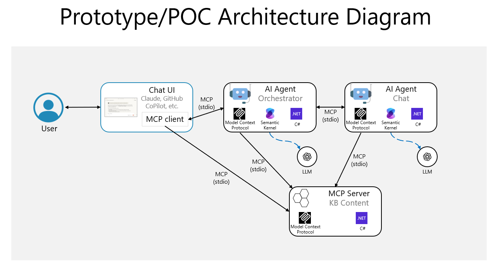

# Architecture and Technologies Document

T#### Naming Standard
- Use **Chat Agent** as the consistent label going forward. If legacy references exist (e.g., "Intelligent Chat Agent"), treat them as aliases with a planned cleanup pass.
- Orchestration Agent is the *only* component permitted to call multiple agents/tools in one logical user turn (single coordination locus). document presents a comprehensive analysis of architecture alternatives and technology stack recommendations for building a domain-specific AI agent system focused on Azure Managed Grafana (AMG). The architectural approach emphasizes modular, scalable design patterns that enable rapid prototyping while providing clear evolution paths toward production-ready deployments.

The primary objective is to establish multiple architecture variants that support systematic progression from simple prototype implementations through enterprise-scale deployments. Each variant builds incrementally upon previous implementations, enabling development teams to validate concepts quickly while maintaining architectural flexibility for future scaling requirements.

The architectural analysis addresses three critical deployment scenarios: initial prototype/POC using MCP STDIO for rapid development iteration, MVP implementation incorporating HTTP transport and containerization for distributed deployment, and scalable production architecture supporting Kubernetes orchestration in Azure environments. Each variant leverages the complementary strengths of Model Context Protocol (MCP), Semantic Kernel, and Azure services to create robust, maintainable AI agent systems.

## High-Level Architecture

### System Overview

The proposed architecture implements a modular AI agent system built around four core components that interact through standardized protocols to provide domain-specific conversational capabilities. The Knowledge Base MCP Server manages access to AMG-specific information through MCP-compliant interfaces, enabling flexible data source integration while maintaining security boundaries. The Chat Agent provides conversational AI capabilities through Azure AI Foundry integration, implementing sophisticated natural language processing for user interaction. The Orchestration Agent coordinates between knowledge sources and chat capabilities, implementing complex workflow management through Semantic Kernel's advanced orchestration patterns.

The architectural foundation leverages Model Context Protocol as the primary integration mechanism, providing standardized interfaces that enable loose coupling between system components while maintaining consistent communication patterns. This approach facilitates independent component development, testing, and deployment while ensuring reliable inter-component communication across different transport mechanisms and deployment environments.

### Component Interactions

The system implements a layered interaction model where user requests flow through the Orchestration Agent, which coordinates knowledge retrieval through the KB MCP Server and response generation through the Chat Agent. This design enables sophisticated conversation management while maintaining clear separation of concerns between knowledge access, conversation logic, and user interface integration.

The Orchestration Agent serves as the primary coordination point, implementing Semantic Kernel's orchestration patterns to manage complex multi-step interactions that might require multiple knowledge lookups, context analysis, and response synthesis. The agent maintains conversation state, manages context windows, and coordinates tool usage to provide coherent, helpful responses that leverage the full capabilities of the knowledge base and chat system.

### Core Components

The system consists of four primary components that work together to deliver conversational AI capabilities:

| Component | Responsibility | Interface |
|-----------|----------------|-----------|
| **Chat UI** | Human interaction interface (CLI, MCP client, web UI) | Submits user requests and displays responses |
| **Orchestration Agent** | Conversation coordination, multi-step planning, context management | Receives requests, coordinates tools/agents, maintains conversation state |
| **Chat Agent** | LLM interaction, prompt construction, response processing | Handles Azure AI Foundry calls and response formatting |
| **KB MCP Server** | Domain knowledge access via MCP protocol | Provides AMG-specific information through MCP tools |

### Component Interaction Flow
1. **Chat UI** submits user utterance to **Orchestration Agent**
2. **Orchestration Agent** decides: direct LLM request, knowledge lookup, or multi-step plan
3. **Chat Agent** handles LLM interactions (Azure AI Foundry)
4. **Orchestration Agent** synthesizes results and maintains conversation context
5. Response delivered back to **Chat UI**

### Design Principles
- **Single Coordination:** Only Orchestration Agent manages multi-step workflows and can call multiple agents/tools in one logical user turn
- **Clear Separation:** Chat Agent = LLM specifics; Orchestration = business logic  
- **Flexible Deployment:** Components co-located (prototype) or distributed (production)

#### Naming Standard
- Use **Chat Agent** as the consistent label going forward. If legacy references exist (e.g., “Intelligent Chat Agent”), treat them as aliases with a planned cleanup pass.
- - Orchestration Agent is the *only* component permitted to call multiple agents/tools in one logical user turn (single coordination locus).

### Prototype/POC Architecture

### Prototype/POC Architecture

The initial prototype architecture emphasizes simplicity and rapid development iteration through STDIO-based MCP communication and in-process component integration. The Chat UI connects directly to the Orchestration Agent through MCP STDIO, enabling immediate testing and validation through compatible interfaces like GitHub Copilot or Claude Desktop. The Orchestration Agent coordinates with both the Chat Agent and KB MCP Server using STDIO transport, maintaining simple process-based communication that eliminates network complexity during development phases.

This architecture enables rapid prototyping by minimizing infrastructure requirements while providing complete functionality for validation and demonstration purposes. The STDIO transport ensures reliable communication with minimal configuration overhead, allowing development teams to focus on agent logic and conversation quality rather than deployment complexity.

## Technologies, Stack & Tools

### Core Technology Stack

The architecture centers on .NET/C# with Microsoft's AI development ecosystem:

- **Model Context Protocol**: Production-ready .NET SDK with ASP.NET Core patterns
- **Semantic Kernel**: AI agent orchestration with planning and memory management  
- **Azure AI Foundry**: Enterprise-grade OpenAI access with security and compliance

#### .NET Version Strategy

Current guidance recommends **.NET 10 (Preview 6+)** for new MCP/Semantic Kernel projects when preview risk is acceptable, while production workloads should remain on **.NET 8 LTS** until .NET 10 GA.

| Track | Runtime | Use Case |
|-------|---------|----------|
| Innovation | **.NET 10 Preview 6+** | New development, experimental projects |
| Stability | **.NET 8 LTS** | Production workloads, risk-averse environments |
| Transitional | .NET 9 | Legacy bridge only |

> **Note**: .NET 10 previews lack official MCP templates—teams scaffold manually.

#### Transport Strategy

| Aspect | Current | Emerging | Action |
|--------|---------|----------|--------|
| Local Dev | STDIO | Continues | Primary for inner-loop development |
| Remote | SSE supported | HTTP Streaming preferred | Implement transport abstraction |
| Future | — | WebSocket potential | Track MCP spec updates |

> **Recommendation**: Use transport abstraction (e.g., `IMcpTransportClient`) to enable runtime switching between STDIO, SSE, and HTTP Streaming.

### Prototype/POC Testing Infrastructure (Variant 1 Scope Only)

**Prototype testing adopts a minimal strategy focused on iteration speed over exhaustive coverage:**

| Layer | Scope (Variant 1) | Tooling | Deferral Notes |
|-------|-------------------|---------|----------------|
| Unit | MCP tool parameter validation & simple success path | xUnit / MSTest (light) | Edge/error branches largely deferred |
| Integration | Orchestrator ↔ KB Server (STDIO) basic round‑trip | In-process harness | Multi-transport & failure simulation deferred |
| Prompt / Semantic | Golden prompt snapshots + manual qualitative review | Promptfoo (optional), manual | Automated semantic similarity scoring deferred |
| Observability | Console logging only | Built-in logging | Structured & telemetry pipelines deferred |
| Performance | Ad-hoc manual timing (single run) | Stopwatch / simple script | Load, soak, stress deferred |

**Principle**: Ship a working conversational loop first; harden testing in later variants.

## Architecture Variants

### Variant 1: Initial Prototype/POC

**Technology Stack:**
- .NET 10 (Preview 6+) / C# — fallback: .NET 8 LTS
- MCP SDK for .NET (STDIO transport)
- Semantic Kernel for agent orchestration
- Azure AI Foundry for LLM capabilities
- File-based knowledge storage

**Characteristics:**
Console applications communicating via STDIO transport. KB MCP Server reads from local files, Chat Agent runs in-process with Semantic Kernel, Orchestration Agent coordinates via STDIO. Prioritizes rapid development and validation over scalability.

**Testing:** Unit tests for MCP tools, integration tests for coordination, manual conversation validation.

**Deployment:** Simple executables with config files, requires only .NET runtime and Azure AI Foundry API credentials.

### Variant 2: Local Decoupled Solution (Testing/QA)

**Technology Stack:**
- Previous stack (.NET 10 Preview where feasible; .NET 8 acceptable)
- MCP HTTP/SSE transport + STDIO for local tooling
- Docker + Docker Compose for orchestration
- Enhanced configuration management

**Characteristics:**
Components run in Docker containers with HTTP-based MCP communication. Enables distributed deployment while maintaining local development simplicity.

> **STDIO vs HTTP**: Docker isolation requires HTTP transport—process boundaries block STDIO sharing, HTTP provides native port exposure and service discovery.

**Testing:** Prototype tests continue unchanged. Additional container networking and transport parity tests TBD.

### Variant 3: MVP (Azure Container Apps)

**Technology Stack:**
- Previous stack + Azure Container Apps
- Azure Application Insights for monitoring
- Azure Key Vault for secrets management
- CI/CD pipeline integration

**Characteristics:**
Managed container orchestration with enterprise-grade capabilities. Independent container apps with automatic scaling, monitoring, and integrated security. HTTP-based MCP communication with production monitoring and secrets management.

**Production Features:** Monitoring, scaling, and secrets integration planned. Formal test expansion (resilience, load, security) TBD.

### Variant 4: Scalable Production (Azure Kubernetes Service)

**Technology Stack:**
- Previous stack + Azure Kubernetes Service (AKS)
- AKS Fleet Manager for multi-cluster scaling
- Azure Monitor + Azure AI Foundry tracing
- Enterprise security and compliance features

**Characteristics:**
Comprehensive Kubernetes orchestration with unlimited scaling. Multi-cluster deployments via Fleet Manager for global distribution. Advanced monitoring with AI tracing for agent behavior analysis.

**Enterprise Features:**
Security controls, compliance monitoring, audit trails, enterprise identity integration. Multi-region deployment with disaster recovery and backup/restore capabilities.

## Technology Differentiators

### Key Benefits

- **MCP Protocol**: Standardized integration, up to 30% accuracy improvement vs traditional methods, dual transport support
- **Semantic Kernel**: Multi-agent orchestration patterns (Sequential, Concurrent, Handoff, Group Chat), Azure integration, unified developer experience
- **Azure Integration**: Enterprise-grade services with compliance, monitoring, security features, managed infrastructure
- **.NET Ecosystem**: Mature tooling, ASP.NET Core patterns, Visual Studio integration, extensive testing frameworks

## Future Testing Roadmap (Post-Prototype)

The following capabilities are *intentionally deferred* until after the Prototype (Variant 1) delivers validated core value:

| Future Capability | Target Variant | Trigger to Implement | Success Metric |
|-------------------|---------------|----------------------|----------------|
| Transport parity tests (STDIO vs HTTP/SSE) | 2 | HTTP transport adoption | <5% behavioral drift across transports |
| Container integration tests | 2 | First Docker Compose baseline | Green build under Compose matrix |
| Performance baseline & regression guard | 2 → 3 | Latency concerns / scaling goals | p95 latency stable ±10% over 5 builds |
| Structured observability (traces, Langfuse) | 3 | MVP readiness review | Key spans captured & searchable |
| Load & resilience (chaos, restart, network loss) | 3 → 4 | Pre-production gate | Automated scenario pass rate ≥95% |
| Security scanning & secret handling tests | 3 | Introduction of Key Vault / managed identity | Zero critical findings |
| Multi-region failover simulation | 4 | AKS multi-cluster planning | RPO/RTO targets validated |
| Advanced semantic evaluation harness | 3 | Prompt complexity growth | Drift alerts actionable (<15% unacceptable variance) |
| Human evaluation rubric & inter-rater scoring | 3 | Pilot user feedback cycle | Agreement coefficient ≥ target threshold |

**Principle**: Defer sophistication until signal justifies cost. Each capability includes clear activation triggers.

## Conclusion

This architecture provides a systematic progression from simple STDIO-based prototypes to enterprise-grade Kubernetes deployments. The .NET/C#, MCP, and Semantic Kernel technology stack offers robust AI agent capabilities while leveraging proven Microsoft technologies for enterprise compatibility.

The modular design ensures prototype investments translate to production capabilities while providing flexibility for changing requirements. Organizations can start with minimal infrastructure and evolve toward enterprise-scale deployments along clear migration paths.