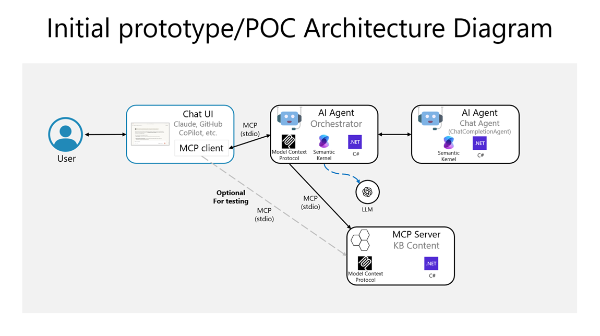

# Spec-Driven Vibe Coding Challenge Documentation

Welcome to the comprehensive documentation for the **Spec-Driven Vibe Coding Challenge** project!

## 🚀 From Vibes to Value: A Spec-Driven AI Development Journey

This project demonstrates how to move from hypothesis to prototype in an evidence-driven manner, creating specialized AI agents for Azure Managed Grafana (AMG) using the Model Context Protocol (MCP).

## 📖 Documentation Overview

### 🎯 Getting Started
- **[Vision & Scope](03-idea-vision-scope.md)** - Project vision, scope, and requirements
- **[Architecture & Technologies](04-architecture-technologies.md)** - Architecture patterns and technology stack
- **[Simplified Directions](simplified-directions/architecture-and-technology-directions.md)** - Quick technical directions and architecture diagrams

### 🛠️ Implementation
- **[Feature Specifications](specs/feature-specs-kb-mcp-server.md)** - Detailed specifications for all components
- **[Implementation Plans](implementation-plans/feature-implementation-plan-kb-mcp-server.md)** - Step-by-step coding plans for each component

### 🔬 Research & Analysis
- **[Assumptions](assumptions.md)** - Project assumptions and hypotheses
- **[Tradeoffs](tradeoffs.md)** - Design decisions and tradeoffs made
- **[Metrics & Measurement Plan](metrics-measurement-plan.md)** - Success metrics and measurement strategies

## 🏗️ Architecture Overview

The system consists of three main components:

1. **Knowledge Base MCP Server** - Manages domain-specific content and search capabilities
2. **Orchestrator Agent** - Coordinates between different MCP servers and manages conversations
3. **Chat Agent** - Provides the conversational interface (future component)

## 🚀 Key Features

- **Domain-Specific Intelligence**: Specialized knowledge for Azure Managed Grafana
- **Modular Architecture**: Reusable components that can be adapted for other domains
- **MCP Protocol Integration**: Uses Model Context Protocol for cross-agent communication
- **Evidence-Driven Development**: Hypothesis-driven approach with measurable outcomes

## 📚 Technical Stack

- **Backend**: C# .NET 8+ with Semantic Kernel SDK
- **Communication**: MCP (Model Context Protocol) for agent interactions
- **Architecture**: Microservices with potential for containerization
- **Testing**: xUnit for comprehensive testing coverage

## 🎯 Project Goals

This project aims to demonstrate:

1. **Spec-Driven Development**: Moving from vague ideas to concrete specifications
2. **Evidence-Based Decisions**: Using metrics and feedback to guide development
3. **Modular AI Systems**: Building reusable components for specialized domains
4. **Professional Development Practices**: Following best practices in AI agent development

## 🔗 Quick Links

- [GitHub Repository](https://github.com/CESARDELATORRE/spec-driven-vibe-coding-challenge)
- [Getting Started Guide](https://github.com/CESARDELATORRE/spec-driven-vibe-coding-challenge#readme)
- [Development Setup](https://github.com/CESARDELATORRE/spec-driven-vibe-coding-challenge/tree/main/setup)

---

*This documentation is automatically generated and deployed to GitHub Pages. Last updated: {{ site.time }}*